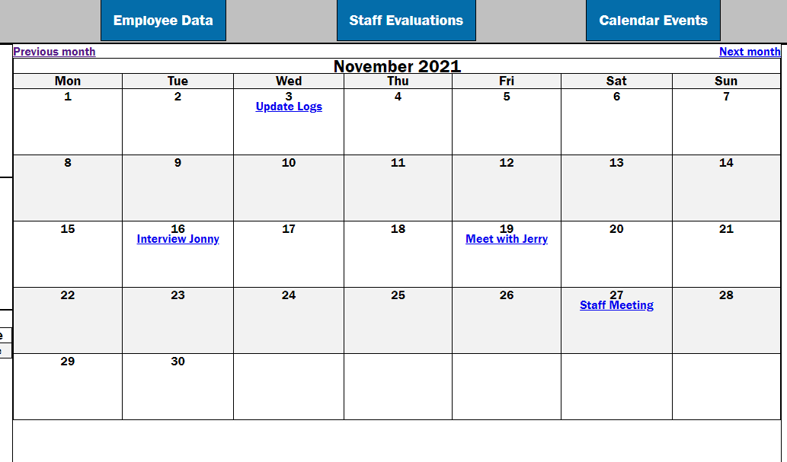
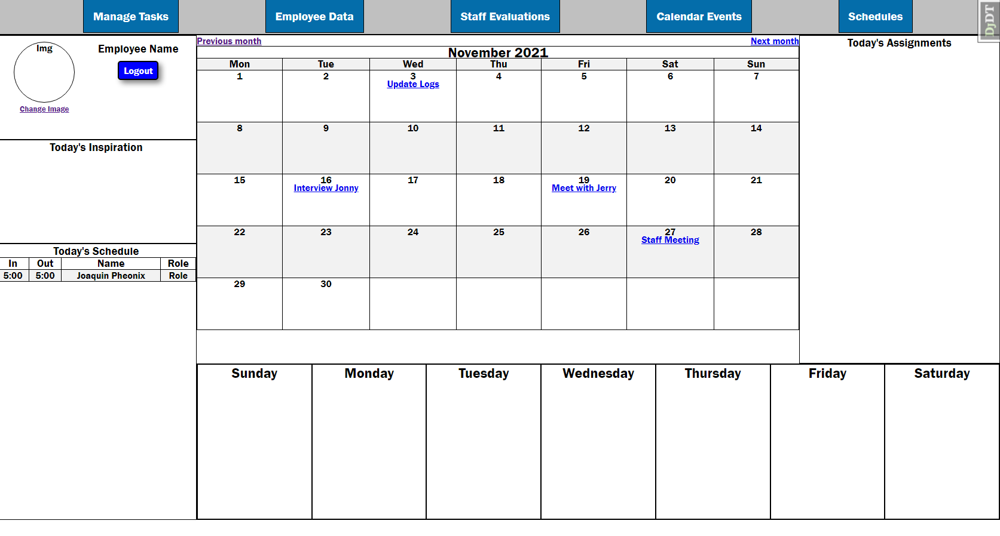
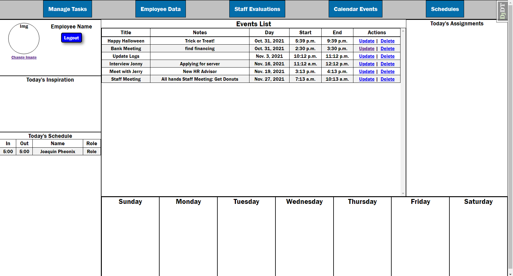
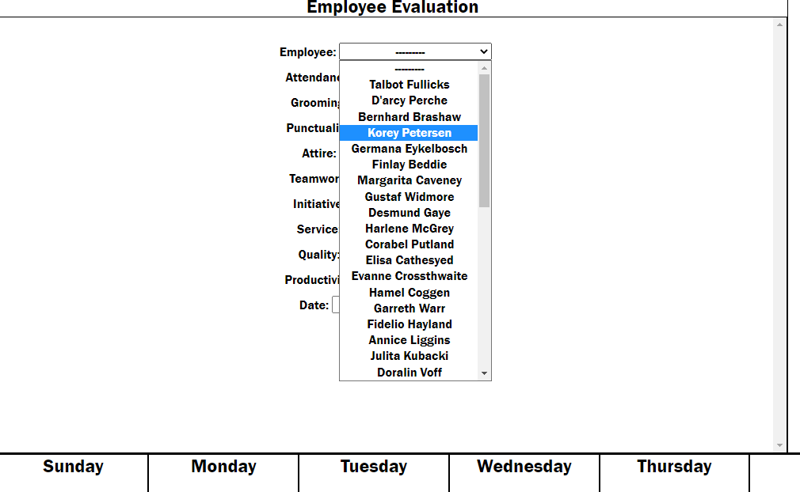
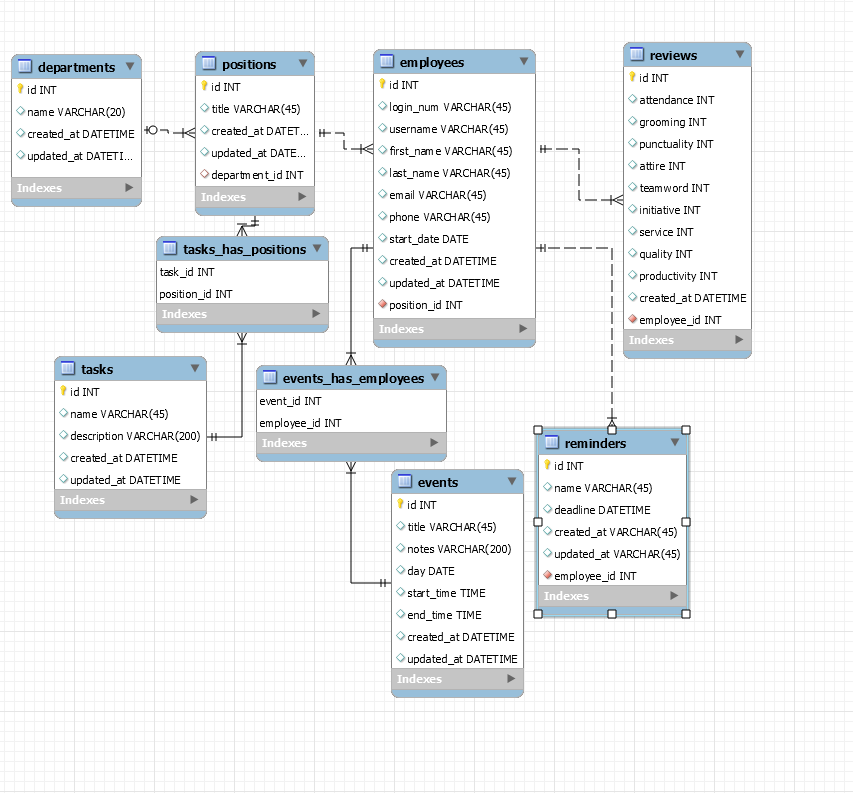

# Employee Management and Events Portal:

## Project Goal:
Build a Web based dashboard application providing the following services:
 - Employee Record Keeping
 - Performance Evaluation Creation and Comparison
 - Calendar Event Tracking and Review
 - Task Assignment Creation and Delegation

Knowledge base of the following technologies utilized and developed upon:
- Using Django's built-in class based views for CRUD operations
- Utilize many-to-one and one-to-one relationships and perform database normalization on backend using MySQL
- Use command line to implement inpectdb command for Django model creation
- Implement custom validation on model input data
- Use Django tags and filters for page render and performing operations on model data
- Use Javascript for interactive webpage elements

## Implement a calendar for event viewing and reference 

Calendar code provided by 
## Landing page for dashboard user

## List of events for review and edit

## List of employees with Evaluations to select from

## Backend ERD Model created using MySQL

